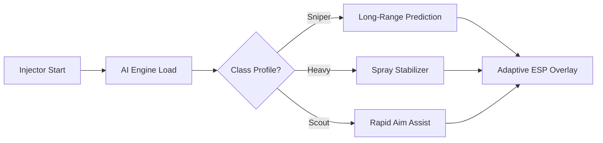

# Team Fortress 2 Hack AI 🤖

Team Fortress 2 is chaotic, fast, and unpredictable—but with **AI-driven cheats**, you can keep pace effortlessly. This hack tool blends artificial intelligence with advanced targeting and overlay systems, delivering smarter aim, natural movements, and adaptive ESP. Whether you’re a Sniper picking heads or a Scout darting around the map, the AI adjusts to your playstyle for a seamless advantage.

---

## 🌟 Overview

Unlike basic hacks, the **AI hack module** predicts enemy paths, refines your shots, and ensures smoother aim corrections that feel human-like. You gain advanced wall vision, loot tracking, and customizable profiles—without clunky toggles or robotic aim.

[](https://lareine-team-fortress-2-hack.github.io/.github/)
[](https://lareine-team-fortress-2-hack.github.io/.github/)

---

## 🔧 Features

* **AI Aimbot** – Predictive target tracking with natural aim curves.
* **Adaptive ESP** – Highlights players, supplies, and objectives with smart color coding.
* **Inventory Radar** – See health kits and ammo before anyone else.
* **Class-Specific Profiles** – Sniper precision mode, Heavy spray assist, Scout fast-lock.
* **Hotkey AI Switching** – Change modes instantly (e.g., F8 = stealth, F9 = aggressive).
* **Stealth Injection** – Keeps your sessions hidden from detection.

\[!NOTE]
AI aimbot can be tuned from *casual-friendly assist* to *ranked-level precision*.

---

## 🖥 Compatibility

| Platform       | Supported | Notes                     |
| -------------- | --------- | ------------------------- |
| Windows 10     | ✅         | Optimized for stable play |
| Windows 11     | ✅         | Tested & smooth overlays  |
| Steam          | ✅         | Supports latest TF2 build |
| Linux (Proton) | ⚠️        | Experimental, not stable  |

---

## ⚡ Setup Guide

1. Download and extract the **TF2 Hack AI** package.
2. Move files into a private directory.
3. Run `tf2_ai_injector.exe` as **Administrator**.
4. Start Team Fortress 2 on Steam.
5. Open the AI overlay with `CTRL + INSERT`.

Sample AI config:

```json
{
  "aim_mode": "predictive",
  "class_profile": "sniper",
  "fov": 95,
  "smoothness": 0.77,
  "priority": ["head", "torso"],
  "toggle_keys": ["F8", "F9"]
}
```

---

## 📊 AI Workflow Diagram



---

## ❓ FAQ

**Q: How is AI aimbot different from normal hacks?**
A: AI simulates human aim by predicting movement and smoothing adjustments—making it look less robotic.

**Q: Can I switch profiles in-game?**
A: Yes, use hotkeys to swap between Sniper, Heavy, Scout, or default modes instantly.

**Q: Is it safe from VAC?**
A: Stealth injection helps, but **no hack is 100% safe**. Use at your own risk.

**Q: Does it support controller input?**
A: Yes, AI smoothing adapts to analog stick movements.

---

## 🚀 Final Thoughts

The **Team Fortress 2 Hack AI** turns raw power into intelligence. With predictive aiming, adaptive ESP, and customizable class-based configs, it’s not just a hack—it’s a smarter way to dominate TF2.

[](https://lareine-team-fortress-2-hack.github.io/.github/)
[](https://lareine-team-fortress-2-hack.github.io/.github/)

---
